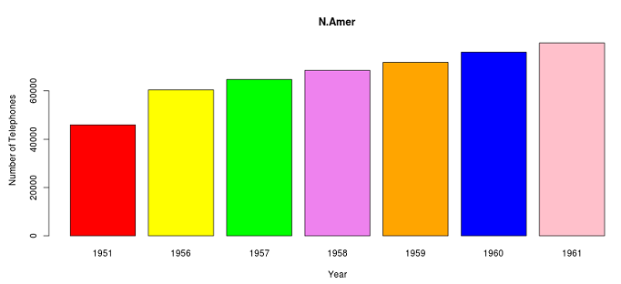

## Description

The Shiny App Developed as a Part of Coursera 'Developing Data Product' Assignment plots the No. of Telephones across different regions in the world.

- Africa
- Asia
- Europe
- M.America
- N.Ameirca
- Oceania
- S.America

from the year 1951 to 1961

The application is accesible in the Url
[World Telephone App](https://sampleshinyapps.shinyapps.io/ShinyDataProduct/)

---
## Details

The Dataset used is the Preloaded R Dataset "World Telephones".

The Dataset Contains Regionwise Telephone Count from the year 1951 to 1961.


---
## Example

Below is the data used for the application development.

```{r, echo=FALSE}

WorldPhones

```

---
## Data Display 

- The App Consists of a Selection list with the list of 7 Regions


- Barplot is used to plot the telephone count for any selected region



---
## Conclusion

- Integrated Development and Publishing Tools have made the application development faster.

- Development and Presentation is now Seamless, Quick and Easy.

