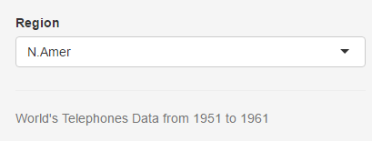

## Description

The Shiny App Developed as a Part of Coursera 'Developing Data Product' Assignment plots the No. of Telephones across different regions in the world.

- Africa
- Asia
- Europe
- M.America
- N.Ameirca
- Oceania
- S.America

from the year 1951 to 1961

The application is accesible in the Url
[World Telephone App](https://sampleshinyapps.shinyapps.io/ShinyDataProduct/)

---
## Details

The Dataset used is the Preloaded R Dataset "World Telephones".

The Dataset Contains Regionwise Telephone Count from the year 1951 to 1961.


---
## Example

Below is the data used for the application development.


```
##      N.Amer Europe Asia S.Amer Oceania Africa Mid.Amer
## 1951  45939  21574 2876   1815    1646     89      555
## 1956  60423  29990 4708   2568    2366   1411      733
## 1957  64721  32510 5230   2695    2526   1546      773
## 1958  68484  35218 6662   2845    2691   1663      836
## 1959  71799  37598 6856   3000    2868   1769      911
## 1960  76036  40341 8220   3145    3054   1905     1008
## 1961  79831  43173 9053   3338    3224   2005     1076
```

---
## Display - Selection List

- The App Consists of a Selection list with the list of 7 Regions




---
## Display - Bar Plot

- Barplot is used to plot the telephone count for any selected region


---
## Conclusion

- Integrated Development and Publishing Tools have made the application development faster.

- Development and Presentation is now Seamless, Quick and Easy.

